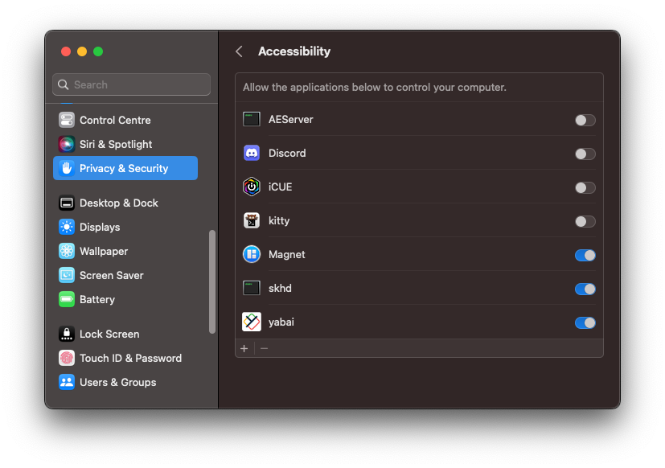

# .dotfiles

> ⚠️ Intended for private use only.

https://user-images.githubusercontent.com/126299768/234208139-0778ec7d-139f-4bd7-93ab-64f9e89b2d9d.mov

This setup uses a 'bare' respository to track configuration files, rather than symlinks and scripts.

It follows [this idea](https://news.ycombinator.com/item?id=11071754) shared by StreakyCobra (referenced in this [blog post](https://www.atlassian.com/git/tutorials/dotfiles)).

The alias `dot` is used to perform Git operations on this repo (this is defined in `~/.zshrc` once cloned).

### Setup

**This process assumes you already have the XCode Command Line Tools and Git installed.**

In Terminal run this [script](https://gist.github.com/m0xAy/ed64d1631c417cb476cb959050996638):

```sh
curl -fsSL https://gist.githubusercontent.com/m0xAy/ed64d1631c417cb476cb959050996638/raw/ | zsh
```

It's fairly self-explanatory, you can see what will be installed by visiting the link above.

Once complete, you should be able to close Terminal and open [Kitty](https://sw.kovidgoyal.net/kitty/)🤞.

### Running Tmux for the first time

When running `tmux` for the first time, you will need to install plugins by running `Prefix` + `I`.

### Running yabai and skhd for the first time

Start `yabai` by running `yabai --start-service`. This will install and start the service, while also setting it up to launch automatically on startup.

You will also need to allow `yabai` and `skhd` to access your computer. You may be prompted to do this automatically when they start, or you can find the toggles this way:

_System Settings_ -> _Privacy & Security_ -> _Accessibility_



### Configuring MacOS Spaces

Update these settings in _System Settings_:

- _Desktop & Dock_ -> _Mission Control_ -> _Automatically rearrange Spaces based on most recent use_ (disable)
  
- _Accessibility_ -> _Display_ -> _Reduce motion_ (enable)
  
- _Keyboard_ -> _Keyboard shortcuts_ -> _Mission Control_ (tick all - see image below)
  
