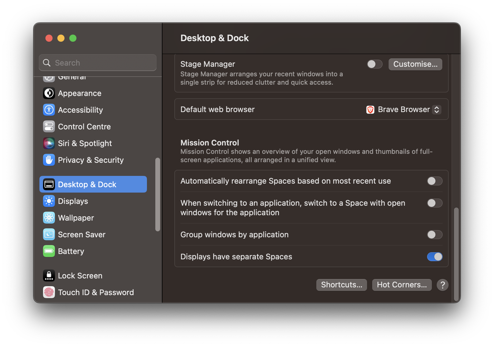
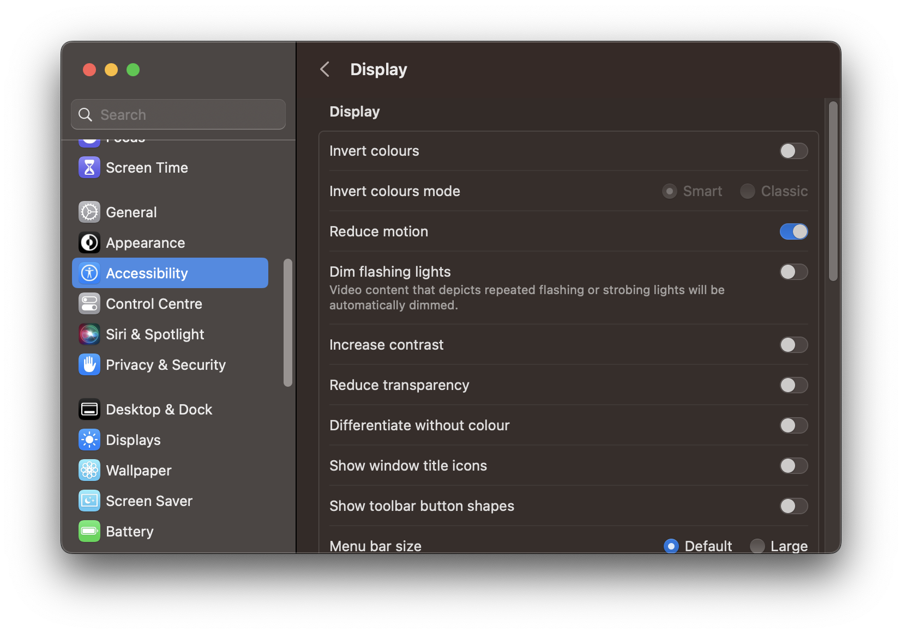
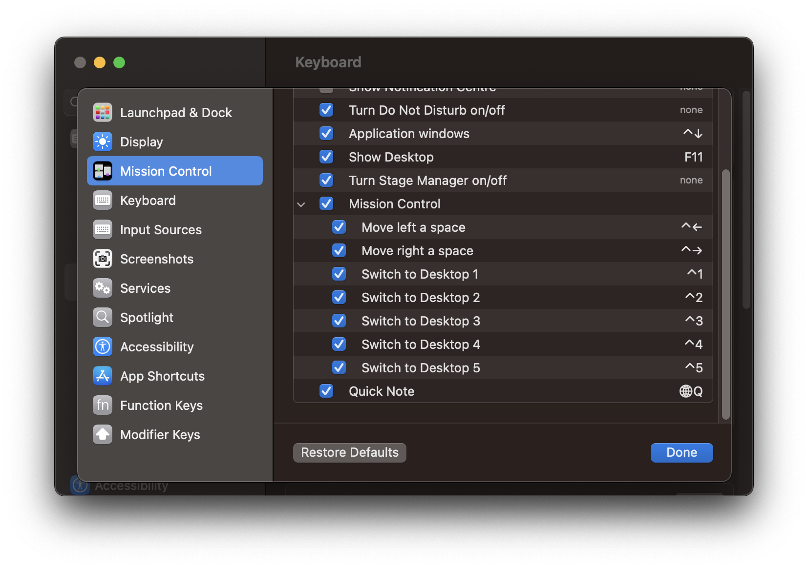

# .dotfiles

> ⚠️  Intended for private use only.

This setup uses a 'bare' respository to track configuration files, rather than symlinks and scripts.

It follows [this idea](https://news.ycombinator.com/item?id=11071754) shared by StreakyCobra (referenced in this [blog post](https://www.atlassian.com/git/tutorials/dotfiles)).

The alias `dot` is used to perform Git operations on this repo (this is defined in `~/.zshrc` once cloned).

### Setup

**This process assumes you already have the XCode Command Line Tools and Git installed.**

In Terminal run this [script](https://gist.github.com/m0xAy/ed64d1631c417cb476cb959050996638):

```sh
curl -fsSL https://gist.githubusercontent.com/m0xAy/ed64d1631c417cb476cb959050996638/raw/ | zsh
```

It's fairly self-explanatory, you can see what will be installed by visiting the link above.

Once complete, you should be able to close Terminal and open [Kitty](https://sw.kovidgoyal.net/kitty/)🤞.

When running `tmux` for the first time, you will need to install plugins by running `Prefix` + `I`.

#### MacOS Spaces

Update these settings in *System Settings*:

- *Desktop & Dock* -> *Mission Control* -> *Automatically rearrange Spaces based on most recent use* (disable)

- *Accessibility* -> *Display* -> *Reduce motion* (enable)

- *Keyboard* -> *Keyboard shortcuts* -> *Mission Control* (tick all - see image below)

